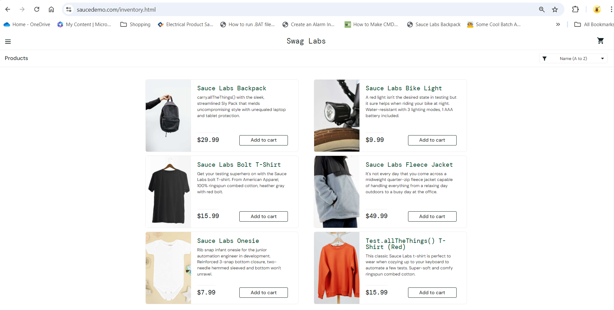
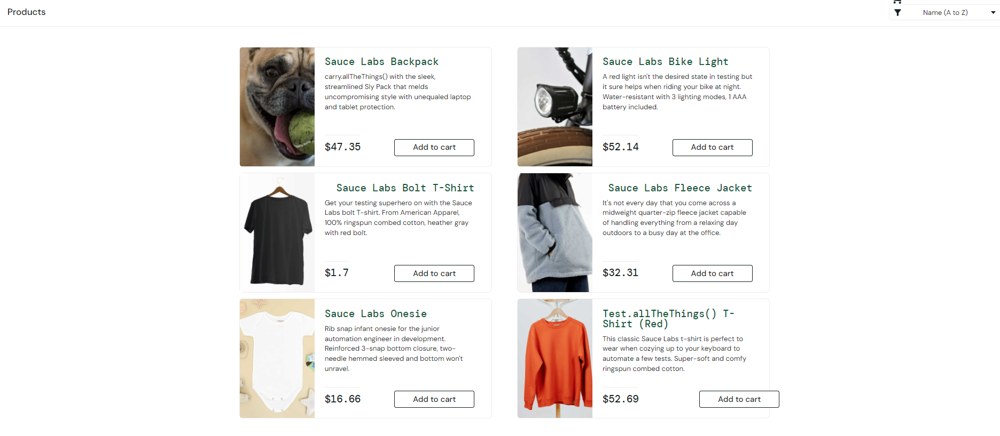
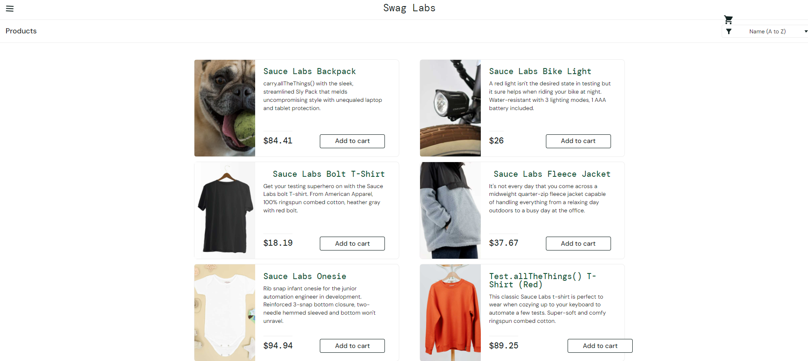

 **improvement: account details,  multi-factor authentication**

# Bug List for SauceDemo Application

## Environment Information
- **Device**: Dell Laptop Inspiron 5491
- **Operating System**: Windows 11 Version 0.0.22631 Build 22631
- **Browser**: Chrome 129.0.6668.90 (100% scale)
- **Application Version**: 1.0
- **username used**:
  - `standard_user`
  - `locked_out_user`
  - `problem_user`
  - `performance_glitch_user`
  - `error_user`
  - `visual_user`
- **Password for all users**:
  - `secret_sauce`

### Bug: Incorrect product description for "Sauce Labs Backpack"
- **Ticket ID**: BR-001
- **Ticket Type**: Bug
- **Severity**: Major
- **Priority**: High
- **Steps to Reproduce**:
  1. Navigate to the product listing page.
  2. Click on "Sauce Labs Backpack" to view its product details.
- **Expected Result**: Description should accurately describe the product's features.
- **Actual Result**: Incorrect description displayed: "carry.allTheThings() with the sleek, streamlined Sly Pack that melds uncompromising style with unequaled laptop and tablet protection."
- **Comments**: This issue is occurring for the following users. Tried with the following usernames (all with password `secret_sauce`):
  - `standard_user`
  - `problem_user`
  - `performance_glitch_user`
  - `error_user`

---

### Bug: Quantity cannot be increased for products

- **Ticket ID**: BR-002
- **Ticket Type**: Bug
- **Severity**: Major
- **Priority**: High
- **Steps to Reproduce**:
  1. Navigate to product listing page.
  2. Try to increase quantity of "Sauce Labs Backpack".
- **Expected Result**: User should be able to increase quantity.
- **Actual Result**: Only one item can be added.
- **Comments**: This issue is occurring for all users except locked_out_user`

---

### Bug: Filter arrow is not pressable
- **Ticket ID**: BR-003
- **Ticket Type**: Improvement
- **Severity**: Minor
- **Priority**: Low
- **Steps to Reproduce**:
  1. Navigate to the inventory page.
  2. Attempt to click the filter arrow.
- **Expected Result**: Filter arrow should be clickable.
- **Actual Result**: Filter arrow is not pressable.
- **Comments**:This issue is occurring for all users except locked_out_user`

---

### Bug: Shipping information not requested during checkout
- **Ticket ID**: BR-004
- **Ticket Type**: Bug
- **Severity**: Critical
- **Priority**: High
- **Steps to Reproduce**:
  1. Log in with any valid username and password (e.g., `standard_user` and `secret_sauce`).
  2. Add products to the cart.
  3. Proceed to the checkout page.
- **Expected Result**: The checkout process should prompt the user to enter shipping address information.
- **Actual Result**: The checkout process does not request any shipping address, and it is unclear where the order is being shipped to.
- **Comments**: This needs immediate attention to ensure users can provide shipping details during the checkout process. This issue is occurring for all users except locked_out_user`

--- 

### Bug: Checkout confirmation wording needs improvement
- **Ticket ID**: BR-005
- **Ticket Type**: Improvement
- **Severity**: Minor
- **Priority**: Low
- **Steps to Reproduce**:
  1. Complete checkout process.
  2. Observe confirmation message.
- **Expected Result**: Something like "Your order is being processed and will be packed for shipment. You'll receive a confirmation when it's ready to ship."
- **Actual Result**: "Thank you for your order! Your order has been dispatched, and will arrive just as fast as the pony can get there!"
- **Comments**: Rephrasing for clarity and accuracy regarding order processing. This issue was replicated using username standard_user` and performance_glitch_user`. 

---

### Bug: Incorrect tax calculation
- **Ticket ID**: BR-006
- **Ticket Type**: Bug
- **Severity**: Critical
- **Priority**: High
- **Steps to Reproduce**:
  1. Add products to cart.
  2. Proceed to checkout and observe tax total.
- **Expected Result**: Tax should reflect 10% GST of $129.94.
- **Actual Result**: The total for all six products is $129.94, but it shows Tax: $10.40, resulting in a total of $140.34. 
- **Comments**: This issue was replicated using username standard_user` and performance_glitch_user`. 

---

### Bug: About screen does not open in new tab
- **Ticket ID**: BR-007
- **Ticket Type**: Improvement
- **Severity**: Minor
- **Priority**: Low
- **Steps to Reproduce**:
  1. Click on "About" from the menu.
- **Expected Result**: Should open in a new tab.
- **Actual Result**: Takes user to the About screen instead. 
- **Comments**: This issue is occurring for all users except locked_out_user`

---

### Bug: Navigation issue after returning from About screen
- **Ticket ID**: BR-008
- **Ticket Type**: Backlog
- **Severity**: Low
- **Priority**: Low
- **Steps to Reproduce**:
  1. Open About screen.
  2. Click back.
- **Expected Result**: Should return to previous page.
- **Actual Result**: Goes to login screen with an error.
- **Comments**: Could not be replicated

---

### Bug: Error messages for invalid login are partially cut off
- **Ticket ID**: BR-009
- **Ticket Type**: Bug
- **Severity**: Major
- **Priority**: High
- **Steps to Reproduce**:
  1. Attempt to login with invalid credentials.
- **Expected Result**: Full error message should be visible.
- **Actual Result**: Text is chopped from top and bottom.
- **Comments**: 

---

### Bug: Error message displays 'Epic sadface' instead of a face icon
- **Ticket ID**: BR-010
- **Ticket Type**: Bug
- **Severity**: Medium
- **Priority**: Medium
- **Steps to Reproduce**:
  1. Go to the login page.
  2. Attempt login with one of the following conditions:
     - Leave the username blank
     - Leave the password blank
     - Enter an incorrect username or password
- **Expected Result**: Error message should display with a relevant face icon instead of text.
- **Actual Result**: Error message shows 'Epic sadface' as plain text for all invalid login attempts.
- **Comments**: 

---

### Bug: Incorrect product name for "Test.allTheThings() T-Shirt (Red)"
- **Ticket ID**: BR-012
- **Ticket Type**: Bug
- **Severity**: Major
- **Priority**: High
- **Steps to Reproduce**:
  1. Navigate to the product listing page.
  2. Click on "Test.allTheThings() T-Shirt (Red)" to view its details.
- **Expected Result**: Product name should match the actual product being sold.
- **Actual Result**: Product name appears incorrectly as "Test.allTheThings() T-Shirt (Red)."
- **Comments**: Needs correction in both the product list and product details page. 

---

### Bug: "Reset App State" option lacks clarity
- **Ticket ID**: BR-013
- **Ticket Type**: Improvement
- **Severity**: Minor
- **Priority**: Low
- **Steps to Reproduce**:
  1. Navigate to the product listing page.
  2. Click on the menu button (hamburger icon).
  3. Observe the "Reset App State" option and use it.
- **Expected Result**: "Reset App State" should clearly explain its functionality or be renamed to reflect its action.
- **Actual Result**: The option removes cart items, but its name does not make this action clear.
- **Comments**: Consider renaming or providing a tooltip explaining the action.

---

### Bug: No sign-up or create account option on login page for new users
- **Ticket ID**: BR-014
- **Ticket Type**: Improvement
- **Severity**: Major
- **Priority**: High
- **Steps to Reproduce**:
  1. Navigate to the login page.
- **Expected Result**: Should have options to sign up or create an account.
- **Actual Result**: No such options available.
- **Comments**: 

---

### Bug: No reset password option on login page
- **Ticket ID**: BR-015
- **Ticket Type**: Bug
- **Severity**: Major
- **Priority**: High
- **Steps to Reproduce**:
  1. Navigate to the login page.
- **Expected Result**: Should have a "Forgot Password" option.
- **Actual Result**: No option for password reset available.
- **Comments**: 

---

### Bug: Product listing page displays same image for all products
- **Bug ID**: BR-016
- **Ticket Type**: Bug
- **Severity**: Major
- **Priority**: High
- **Steps to Reproduce**:
  1. Log in with the username `problem_user` and password `secret_sauce`.
  2. Navigate to the product listing page.
- **Expected Result**: Each product should display its unique image.
- **Actual Result**: All products display the same image.
- **Image**: 
- **Comments**: Investigate image loading logic for products.

---

### Bug: About page returns 404 Not Found
- **Bug ID**: BR-017
- **Ticket Type**: Bug
- **Severity**: Major
- **Priority**: High
- **Steps to Reproduce**:
  1. Log in with the username `problem_user` and password `secret_sauce`.
  2. Click on the "About" section.
- **Expected Result**: The About page should load successfully.
- **Actual Result**: The page returns a 404 Not Found error.
- **Comments**: Check the URL routing for the About page.

---

### Bug: Slow navigation to product listing page
- **Bug ID**: BR-018
- **Ticket Type**: Bug
- **Severity**: Major
- **Priority**: High
- **Steps to Reproduce**:
  1. Log in with the username `performance_glitch_user` and password `secret_sauce`.
  2. Observe the time taken to navigate to the product listing page.
- **Expected Result**: The product listing page should load quickly.
- **Actual Result**: It takes a long time to navigate to the page.
- **Comments**: Investigate backend performance issues.

---

### Bug: Checkout allowed without any products in cart
- **Bug ID**: BR-019
- **Ticket Type**: Bug
- **Severity**: Minor
- **Priority**: Medium
- **Steps to Reproduce**:
  1. Log in with the username `standard_user`and password `secret_sauce`.
  2. Proceed to the checkout page without adding any products to the cart.
- **Expected Result**: The system should prevent checkout without products in the cart.
- **Actual Result**: The user is allowed to checkout and confirm the order.
- **Screenshot**: 
- **Comments**: Critical issue, requires immediate attention.

---

### Bug: User locked out message
- **Bug ID**: BR-020
- **Ticket Type**: Improvement
- **Severity**: Minor
- **Priority**: Low
- **Steps to Reproduce**:
  1. Log in with the username `locked_out_user` and password `secret_sauce`.
- **Expected Result**: The user should be informed that their account is locked, with an option to contact support.
- **Actual Result**: Displays "Epic sadface: Sorry, this user has been locked out." and there is no option to contact the help team.
- **Comments**: Implement a contact option for locked-out users.

---

### Bug: Last name input issue during checkout
- **Bug ID**: BR-021
- **Ticket Type**: Bug
- **Severity**: Critical
- **Priority**: High
- **Steps to Reproduce**:
  1. Log in with the username `problem_user` and password `secret_sauce`.
  2. Navigate to the checkout page.
  3. Enter a value in the first name field.
  4. Attempt to enter a last name.
- **Expected Result**: The last name should be entered correctly without affecting the first name field.
- **Actual Result**: The last name does not display correctly; it shows the recent typed letter in the first name field, deleting the entered first name.
- **Comments**: Investigate input handling in the checkout form.

---

### Bug: Added products persist across different user logins
- **Bug ID**: BR-022
- **Ticket Type**: Bug
- **Severity**: Critical
- **Priority**: High
- **Steps to Reproduce**:
  1. Log in with the username `standard_user`.
  2. Add products to the cart.
  3. Log out.
  4. Log in with a different username.
- **Expected Result**: The cart should be empty for the new user.
- **Actual Result**: Products added by one user are still showing up when logging in with different usernames.
- **Comments**: Investigate cart session management for different users.

---

### Bug: Add to cart button not functioning correctly
- **Bug ID**: BR-023
- **Ticket Type**: Bug
- **Severity**: Major
- **Priority**: Medium
- **Steps to Reproduce**:
  1. Log in with the username `problem_user` and password `secret_sauce`.
  2. Navigate to the product listing page.
  3. Add a product to the cart.
  4. Observe the behavior of the "Add to Cart" button.
  5. Click on the "Remove" button.
- **Expected Result**: The product should be added to the cart, and the "Add to Cart" button should change to "Remove". Clicking "Remove" should remove the product from the cart.
- **Actual Result**: The product is added, and the button changes to "Remove", but clicking "Remove" does not work.
- **Comments**: 

### Bug: Incorrect product image and random pricing for "Sauce Labs Backpack"
- **Ticket ID**: BR-024
- **Ticket Type**: Bug
- **Severity**: Critical
- **Priority**: High
- **Steps to Reproduce**:
  1. Log in with the username `visual_user` and password `secret_sauce`.
  2. Navigate to the product listing page.
- **Expected Result**: The correct image and consistent pricing for the "Sauce Labs Backpack" should be displayed.
- **Actual Result**: The image of the "Sauce Labs Backpack" is incorrect, and the prices appear randomly each time the user logs in.
- **Screenshot**: Product listing page when logged in using standard_user  
Product listing page when logged in using visual_user 
Product listing page when logged in a second time using visual_user 
- **Comments**: This issue needs to be resolved to ensure product consistency and accurate representation for users.

---

### Bug: "Reset App State" option lacks clarity
- **Ticket ID**: BR-025
- **Ticket Type**: Bug
- **Severity**: Minor
- **Priority**: Medium
- **Steps to Reproduce**:
  1. Navigate to the product listing page.
  2. Add few products in the cart
  3. Click on the menu button (hamburger icon).
  4. Click on the "Reset App State" option.
  5. Verify it removes all the products from the the checkout and also changes the button state from 'Remove' to 'Add to cart' state
- **Expected Result**: "Reset App State" should clearly explain its functionality or be renamed to reflect its action.
- **Actual Result**: The option removes cart items, but its name does not make this action clear.
- **Comments**: Consider renaming or providing a tooltip explaining the action.

---

